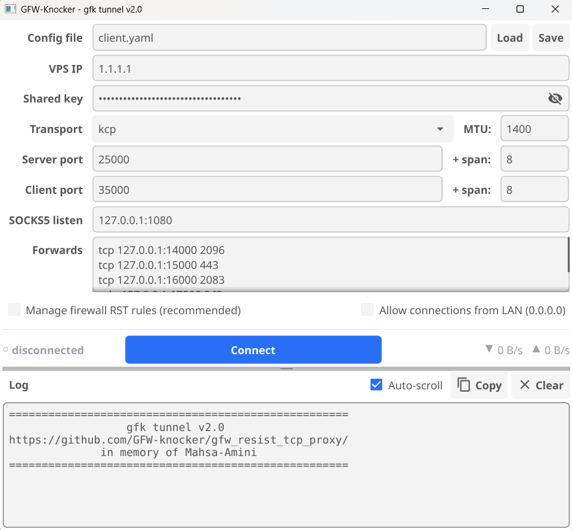

# Quick setup
1. install on linux vps ( if you dont like install script, you can manually run binary on vps in tmux)

```sh
bash <(curl -fsSL 'https://raw.githubusercontent.com/GFW-knocker/gfw_resist_tcp_proxy/main/go%20implementation/scripts/gfk.sh') install
```
2. edit client.yaml
```
vps_ip
server_port
client_port
auth_key
forwards
- {proto: tcp, listen: "0.0.0.0:12000", target_port: 443} --> this listen on pc_ip:12000 , forward traffic to vps_ip:443
```
3. edit server.yaml
```
server_port
auth_key
allowed_ports (when leave empty , client can forward its traffic to any port)
```
4. run both client and server and wait to see 
```
kcp tunnel established
```

# gfk tunnel — Go implementation

A Go rewrite of the original Python variant (in `../python implementation/`).
Same idea, but with a proper reliability layer, multiplexing, keepalive/auto-reconnect,
multi-client support, and no Python/scapy in the hot path.

## Architecture

```
tunnel/      port-forward + SOCKS5 listeners (client) · dial backend/target (server)
   │           each stream starts with an HMAC-authenticated connect header
transport/   pluggable reliability + mux:  KCP+smux(+FEC)  |  QUIC
   │           both run over a net.PacketConn
carrier/     fake-TCP net.PacketConn: craft/sniff TCP ACK+PSH, NO SYN
   │           Linux: AF_INET raw send + AF_PACKET capture (cgo-free)
   │           Windows: Npcap via wpcap.dll syscall bindings (cgo-free)
firewall/    RST suppression (iptables on Linux, Windows Firewall on Windows)
```

The carrier is **connectionless**: it never "disconnects", so reconnection only
re-establishes the KCP/QUIC session on top (handled by `supervisor/`). Because the
carrier's `ReadFrom` reports each packet's real source address, one server
demultiplexes many client PCs automatically.

## Build

The **CLI** (`cmd/gfk`, client + server) is cgo-free:

```sh
# Linux server / Linux client:
CGO_ENABLED=0 GOOS=linux  go build -trimpath -ldflags "-s -w" -o gfk      ./cmd/gfk
# Windows client (needs Npcap runtime installed on the target machine):
CGO_ENABLED=0 GOOS=windows go build -trimpath -ldflags "-s -w" -o gfk.exe ./cmd/gfk
```

`-trimpath` keeps local filesystem paths (including your username) out of the
binary and makes the build reproducible; `-s -w` drop the symbol table and DWARF,
which is most of the size. Omitting them produces a working but ~35% larger
binary that has your home directory baked into every stack frame. `make` and the
release workflow both pass them — use `make` rather than a bare `go build`.

The **Windows GUI** (`cmd/gfk-gui`, Fyne) is built separately behind the `gui`
build tag and needs cgo + a C compiler (mingw-w64):

```sh
CGO_ENABLED=1 go build -tags gui -trimpath -ldflags "-s -w -H windowsgui" -o gfk-windows-GUI.exe ./cmd/gfk-gui
```

`-H windowsgui` is what stops a console window opening behind the app. Drop it
(keeping everything else) if you need a build that prints panics to a terminal.

> Caveat: `go mod tidy` run *without* `-tags gui` will prune Fyne from `go.mod`
> (it's only imported under that tag). If that happens, `go get fyne.io/fyne/v2`
> to restore it. The `gui` tag keeps Fyne entirely out of the cgo-free CLI build.


## Releasing (CI)

`.github/workflows/release.yml` builds everything and publishes a GitHub Release.
Trigger it from the **Actions** tab → **Release** → **Run workflow**, entering the
**tag** (e.g. `v0.1.0`, created if new) and **title**. It produces:

- CLI (cgo-free, cross-compiled on one Linux runner): `gfk-linux-{amd64,arm64,armv7,386}`,
  `gfk-windows-{amd64,arm64}.exe`.
- Windows GUI (native cgo build on a Windows runner): `gfk-windows-GUI.exe`.
- Config templates: `server.yaml`, `client.yaml` (copied from `config/*.example.yaml`).

The `gfk.sh` installer pulls `gfk-linux-amd64` / `gfk-linux-arm64` from that release.

> macOS is not built: the raw-packet carrier is linux/windows only. The code still
> compiles on darwin (via `internal/carrier/packetio_other.go`, which fails cleanly
> at startup) — a functional macOS client would need a BPF/libpcap backend.

## Run

Edit `config/server.example.yaml` / `config/client.example.yaml` (set `vps_ip`,
a shared `auth.key`, ports, forwards). Then:

> `vps_ip` is required on the **client** (where to send / whose replies to accept)
> but **optional on the server** — leave it empty and the server derives each
> client's reply source IP from inbound packets. That's the recommended default
> and is also what makes it work behind 1:1-NAT clouds (AWS/GCP/Oracle), where a
> forced public source IP gets dropped by egress anti-spoofing.

```sh
# server (VPS, root):
sudo ./gfk -config server.yaml            # -dropRST to apply firewall rules unprompted

# client (PC, admin + Npcap on Windows / root on Linux):
./gfk -config client.yaml
```

If `-config` is omitted, gfk looks for `server.yaml` / `client.yaml` next to the
binary — so a `gfk` binary sitting alongside its config (e.g. `/root/gfk/`) runs
with no flags.

**Easiest server setup** — the `gfk` installer (`scripts/gfk.sh`, kept in the repo)
downloads the right binary from the GitHub release into `/root/gfk/` (next to its
config), installs a boot-enabled systemd service, and gives you
`gfk {start|stop|restart|status|log|edit|update|uninstall}`:

```sh
bash <(curl -fsSL 'https://raw.githubusercontent.com/GFW-knocker/gfw_resist_tcp_proxy/main/go%20implementation/scripts/gfk.sh') install
```

Publish a GitHub release with just the two binaries `gfk-linux-amd64` and
`gfk-linux-arm64` (built in `dist/`); the installer script is served from the repo,
not the release.

Both sides need to suppress kernel RSTs on the carrier port. gfk does this itself
(prompts once, unless `firewall.manage: yes` or `-dropRST`).

### Forwarding several ports at once (client)

`client.forwards` is a list — each entry is an independent local listener mapped
to a server-side `target_port`, and they **all run simultaneously over the single
tunnel** (one KCP session, smux-multiplexed; not one tunnel per port). Each
`listen` must be unique; targets may differ:

```yaml
client:
  forwards:
    - {proto: tcp, listen: "127.0.0.1:14000", target_port: 2096}
    - {proto: tcp, listen: "127.0.0.1:15000", target_port: 443}
    - {proto: tcp, listen: "127.0.0.1:16000", target_port: 2083}
    - {proto: udp, listen: "127.0.0.1:17000", target_port: 945}
```

A connection to `127.0.0.1:15000` reaches `backend_ip:443` on the server, one to
`:16000` reaches `:2083`, and so on. This works alongside `socks5_listen` (a
SOCKS5 proxy over the same tunnel).

### Surviving a blocked carrier port (port spans)

If a middlebox starts dropping a specific carrier port, gfk recovers on reconnect
without any manual change:

- `carrier.client_port_span` — the client rotates its **source** port each
  reconnect (avoids colliding with the server's still-expiring old session).
- `carrier.server_port_span` — the **server accepts a whole range** of ports, and
  the client rotates the **destination** port it targets each reconnect, stepping
  past a blocked one (a blocked port just costs one ~8 s hello-verify timeout).
  **Must match on both ends** (like the PSK). Default 8.

Rotation (server can't signal a new port over a dead tunnel) is avoided in favour
of a span: the server passively listens on the whole range, so no coordination is
needed. The RST-suppression firewall auto-covers each side's full range.

The two spans are **independent**, which is easy to misread in a packet capture:
with `client_port_span: 2` and `server_port_span: 8` the client's *source* port
only ever alternates between 40000 and 40001, while its *destination* port sweeps
45000–45007. Eight ports on the wire, and `client_port_span` is still being
honoured — it is the destination side you are watching.

**If each reconnect only works on the *next* port** — and restarting both ends
does not help — that is stale middlebox state, not a blocked port. A conntrack /
CGNAT entry outlives the session (Linux holds ESTABLISHED for five days) and still
expects the previous session's sequence window, so `seq_mode: random` and
`seq_mode: realistic`, which open each session at a fresh random ISN, get dropped
on that tuple forever.

The client handles this by sending a bare TCP RST on a tuple whenever it **lets go
of** one — session lost, connect attempt failed, or shutdown. Resetting on release
rather than before use is what makes it free: the middlebox's close timer runs
while gfk is busy elsewhere, so by the time the port rotation comes back around,
the entry is gone. No setting, no delay.

For a tuple poisoned by a run that never released it (an older build, a crash, a
`kill -9`), set `carrier.send_reset_and_wait_before_connect: yes`. That also resets
and waits **12 s** before every attempt — it has to outlast the middlebox's close
timer, 10 s on Linux (`nf_conntrack_tcp_timeout_close`), and a shorter wait is
worse than none, because each retry restarts that timer and the tunnel never
connects. Turn it on, get connected once, turn it off.


### Sequence numbers (`seq_mode`)

What the TCP seq/ack fields of carrier packets do. **Must match on both ends.**

| | header per packet | flow as a whole | speed |
|---|---|---|---|
| `fixed` (default) | `seq = ack = 1`, constant window, no options | nothing to track | full |
| `random` | random ISN + the peer's real ack, jittered window, RFC 7323 timestamps | seq never moves — reads as one segment retransmitted | full |
| `realistic` | same, but seq advances with the payload | reassembles into a genuine TCP stream | **capped ~64 KB/RTT** |


### Automatic Port Rotation

the client also watches the tuple it is using. If nothing arrives for 3 s
while it is actively transmitting, the tuple is being black-holed somewhere on the
path, and gfk drops the session and rotates ports immediately rather than waiting
out the ~16 s transport keepalive on a connection that cannot recover.

### Restricting destination ports (server)

Set `server.allowed_ports` to limit which ports clients may reach (applies to
both port-forwards and SOCKS targets). Empty = any port.

```yaml
server:
  allowed_ports: [443, 2096, 2052]   # clients can only reach these ports
```

### Throughput / latency tuning (`kcp:`)

Run with `nc: 1` (KCP's normal, no-congestion-control mode) and size the **window**
(`sndwnd`/`rcvwnd`, packets) to the link's bandwidth-delay product — this is the one
knob that matters:

    window_pkts ≈ bandwidth_bps × RTT_seconds / 8 / mtu

Too small caps throughput; too large causes bufferbloat (high jitter under load).
The smux buffers auto-size from the window (`stream_buffer`/`session_buffer: 0`), so
you normally tune only the window. Starting points:

| line speed | sndwnd / rcvwnd |
|---|---|
| dial-up ≤256 kbps | 16 |
| slow 1–6 Mbps (default) | 128 |
| broadband 10–50 Mbps | 512 |
| fast 100–500 Mbps | 8192 |

Set the same `nc` + window on **both** ends. For a lossy/adversarial link add
`fec_data: 10` / `fec_parity: 3` (must match on both ends; ~30% bandwidth cost).
Avoid `nc: 0` — kcp-go's congestion control underperforms badly over this carrier
(collapses throughput). Bound bufferbloat with the window instead.


## Requirements

- **Linux**: root (raw sockets + iptables). No libpcap needed.
- **Windows**: Administrator + [Npcap](https://npcap.com) installed (runtime only,
  no SDK).

## Windows GUI

`gfk-windows-GUI.exe` is a single self-contained window (no runtime deps beyond Npcap):


A `client.yaml` (or `gfk.yaml`) sitting next to the exe is loaded automatically at
startup, so the file-only settings are in effect even before you press Load.


